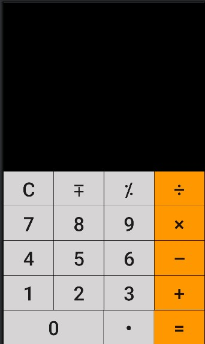

# ماشین حساب ساده اندروید  

یک ماشین حساب خیلی ساده که با **Kotlin** و **View Binding** و layoutهای XML نوشته شده.  
هدف اصلی این پروژه یادگیری مفاهیم پایه‌ای اندروید مثل:

- Activity و lifecycle
- View Binding
- OnClickListener
- مدیریت state ساده (عملیات ریاضی، عدد فعلی، عملیات قبلی)
- کار با EditText و Button

بود.

## ویژگی‌ها
- عملیات اصلی ریاضی: جمع (+)، تفریق (–)، ضرب (×)، تقسیم (÷)
- پشتیبانی از اعداد منفی
- امکان وارد کردن اعشار (.)
- دکمه پاک کردن کامل (C)
- دکمه درصد (%) → (در حال حاضر فقط روی عدد آخر اعمال می‌شود)
- نمایش نتیجه بعد از زدن دکمه مساوی (=)

## تصاویر برنامه

## محتویات
- زبان: **Kotlin**
- و UI: **XML** + **View Binding**
- محیط توسعه: **Android Studio**
- minSdk: معمولاً 21 یا 24 (بسته به تنظیمات خودت)
- بدون کتابخانه خارجی (فقط کد خالص اندروید)

## نقاط قابل بهبود (برای آینده)
- اضافه کردن دکمه backspace (حذف یک کاراکتر)
- مدیریت خطاها (تقسیم بر صفر، ورودی نامعتبر)
- طراحی زیباتر با Material 3 یا Tailwind-inspired style
- پشتیبانی از زنجیره عملیات (مثل 2 + 3 × 4 =)
- اضافه کردن تاریخچه محاسبات
- تم تاریک / روشن
- تبدیل به اپلیکیشن تک‌فعالیتی با Jetpack Compose (در آینده)
